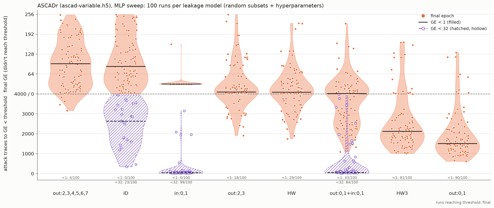
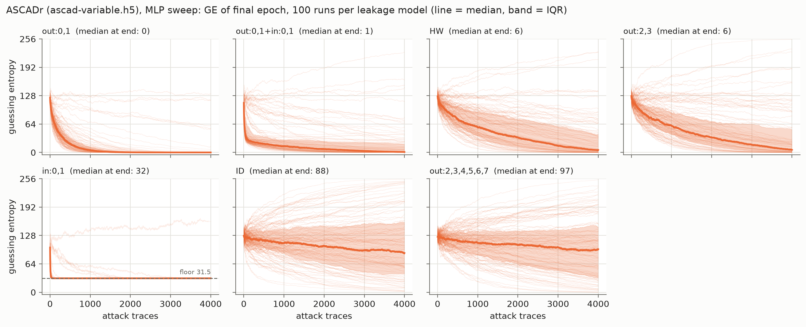
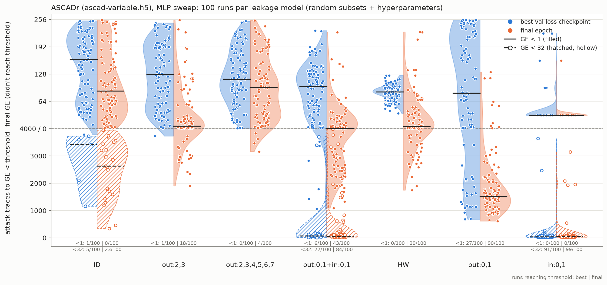
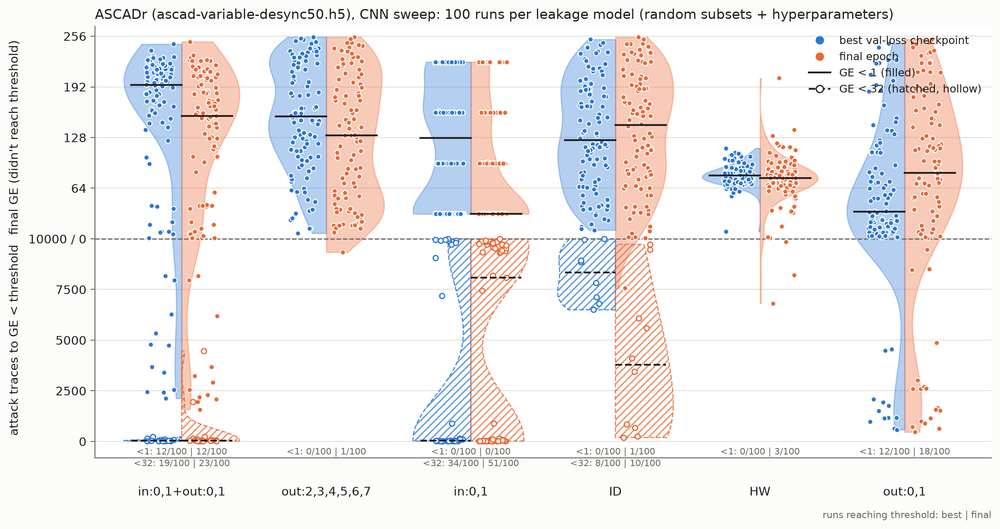
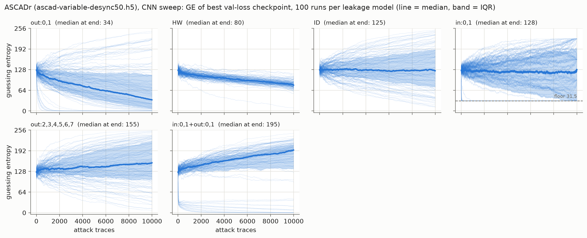
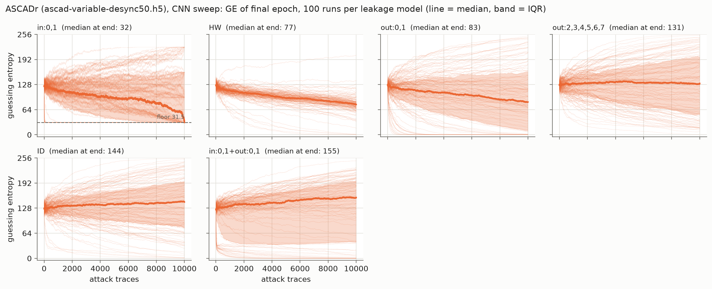

# Training on targeted leakage models: first results

*Status: 2026-09-28. Both sweeps complete: MLPs on ASCADr (100 runs × 7 leakage models) and CNNs on ASCADr desync50 (100 runs × 6 leakage models).*

## TL;DR

- **Training on just the two S-box output LSBs (`out:0,1`) works better than any other label we tried, in both settings.** On ASCADr, 90/100 random MLPs break the key with it (median ~1.5k attack traces), versus 0/100 with ID labels at the same budget (20k profiling traces, 30 epochs). On desync50 with CNNs, everything is much harder, but `out:0,1` still breaks the key most often (18/100) and has by far the lowest median GE.
- **It is the specific bits, not the number of classes.** `out:2,3` is also a 4-class label, trained on identical data and hyperparameters, and only 18/100 MLP runs break the key. Dropping the LSBs (`out:2,3,4,5,6,7`) leaves 4/100.
- **The S-box input bits only ever get us to GE < 32, and adding them to `out:0,1` makes attacks worse.** That first part is expected: they depend on 2 key bits, so they can only find the right group of 64 keys. The surprise is the joint 16-class `out:0,1+in:0,1` label: it breaks the key less often than `out:0,1` alone (MLP 43 vs 90/100, CNN 12 vs 18/100) and is *slower* when both succeed (42 of 43 MLP runs). Our working hypothesis is that the much easier input-share feature starves learning of the output bits (see [Takeaways](#takeaways)).
- **Many desync CNNs are confidently wrong:** their GE ends *above* 128, i.e. worse than a random guess. This affects 75/100 joint-label models and none of the HW models, and is not understood yet.
- **Open:** the data-efficiency question needs a sweep over the number of profiling traces, and the broader question of whether different leakage models make networks learn *different internal representations* has not been tested yet (see [Next steps](#next-steps)).

## Motivation

In Karayalcin et al. (NeurIPS 2025) we found that MLPs trained on ASCADr with standard ID labels mostly exploit the two least significant bits of the S-box input `p⊕k` and of the S-box output `Sbox[p⊕k]`. This project turns that observation into a training-side intervention: instead of reading off which features a network uses, we choose which features the labels ask for.

The questions for this first round:

1. **Sufficiency:** is training only on those bits enough to break the target?
2. **Necessity:** what happens if the labels exclude them?
3. **Data efficiency:** do narrow, targeted labels need fewer profiling traces than ID or HW?

The longer-term question is whether the leakage model changes *what* the network learns internally, e.g. whether an HW-trained network builds very different share embeddings from one trained on `out:0,1`. The attack-performance results here are the first step towards that.

## Setup

**Leakage models.** Labels are built from bits of the S-box input (`in`) and/or output (`out`) of target byte 2. Terms joined by `+` are combined into one joint label.

| spec | label | classes |
|---|---|---|
| `ID` | S-box output byte | 256 |
| `HW` | Hamming weight of the S-box output | 9 |
| `out:0,1` | two LSBs of the S-box output | 4 |
| `out:2,3` | S-box output bits 2 and 3 (class-count control for `out:0,1`; MLP sweep only) | 4 |
| `out:2,3,4,5,6,7` | all output bits except the two LSBs | 64 |
| `in:0,1` | two LSBs of the S-box input | 4 |
| `out:0,1+in:0,1` | the 16 classes Y_i from the paper (written `in:0,1+out:0,1` in the CNN sweep; same information) | 16 |

Labels that only use S-box *input* bits depend on only some key bits, so several key guesses always get the same labels (for `in:0,1`, 64 of them). We count ties as half a rank, so GE bottoms out at 31.5 rather than 0. For those models we also report when the attack reaches GE < 32.

**Training protocol (random search, paired).** Each sweep draws 100 runs. Each run *i* draws a random subset of 20k profiling traces and random hyperparameters, and uses **the same subset and hyperparameters for every leakage model**. Comparisons between leakage models are therefore paired, and the spread within a violin reflects sensitivity to data and hyperparameter choice.

| | MLP sweep | CNN sweep |
|---|---|---|
| dataset | ASCADr (`ascad-variable.h5`, 1400 samples) | ASCADr desync50 (`ascad-variable-desync50.h5`) |
| runs | 100 | 100 |
| training traces | 20k random subset of 180k | 20k random subset of 180k |
| validation | last 10k profiling traces | last 10k profiling traces |
| attack traces | 4k | 10k |
| epochs | 30 | 50 |
| architecture | 2–6 dense layers, width 32–200 | 1–4 conv blocks (Conv1d → act → BN → AvgPool, 4–32 filters doubling per block, kernel 5–51, pool 2–10), then 1–3 dense layers of width 32–200 |

Both sweeps also sample the activation (ELU/ReLU/SELU), the Adam learning rate (1e-4 to 3e-3, log-uniform) and the batch size (128–512). Traces are standardised per sample using the training subset. Every run trained at its sampled batch size.

**Evaluation.** Guessing entropy (GE) averaged over 100 random orderings of the attack traces, for both the final-epoch model and the checkpoint with the lowest validation loss. The violin plots put each run on one "lower is better" scale. Below the dashed line are runs that end with GE < 1, placed by the number of attack traces needed to get there. Above it are runs that don't, placed by their final GE.

## Results: MLPs on ASCADr



*Each dot is one run (final epoch). Hatched purple: runs that reach GE < 32, for leakage models with an input-bit term and ID as reference. Numbers under each violin: runs reaching the threshold.*

| leakage model | classes | runs | GE<1 final | traces to GE<1 (median) | GE<32 final | traces to GE<32 (median) | median final GE | GE<1 best ckpt | median best epoch |
|---|---|---|---|---|---|---|---|---|---|
| `out:0,1` | 4 | 100 | 90 | 1466 | 94 | 318 | 0.0 | 27 | 1 |
| `out:0,1+in:0,1` | 16 | 100 | 43 | 2458 | 84 | 54 | 1.0 | 6 | 1 |
| `HW` | 9 | 100 | 29 | 3102 | 68 | 1350 | 5.5 | 0 | 1 |
| `out:2,3` | 4 | 100 | 18 | 2989 | 74 | 1509 | 6.0 | 1 | 0 |
| `in:0,1` | 4 | 100 | 0* | – | 99 | 43 | 31.5 | 0* | 7 |
| `ID` | 256 | 100 | 0 | – | 23 | 2630 | 88.5 | 1 | 0 |
| `out:2,3,4,5,6,7` | 64 | 100 | 4 | 3548 | 25 | 2377 | 97.0 | 0 | 0 |

\* `in:0,1` cannot reach GE < 1 (floor 31.5). Median trace counts are over the runs that reach the threshold only.

Paired against `out:0,1` (same subset and hyperparameters, final epoch, compared on the combined scale):

| leakage model | runs | `out:0,1` better | other better |
|---|---|---|---|
| `out:0,1+in:0,1` | 100 | 97 | 3 |
| `HW` | 100 | 97 | 3 |
| `out:2,3` | 100 | 96 | 4 |
| `in:0,1` | 100 | 95* | 5 |
| `ID` | 100 | 99 | 1 |
| `out:2,3,4,5,6,7` | 100 | 98 | 2 |

\* Partly by construction, since `in:0,1` can't reach GE < 1.



*GE vs number of attack traces for every run (thin lines), with the median (bold) and interquartile range (band).*

### What this says

**Sufficiency: yes.** Two output bits are enough. `out:0,1` breaks the key in 90/100 runs, and its median GE curve reaches 0 within ~1.5–2k traces. This is consistent with the paper's finding that these bits carry the leakage MLPs actually use.

**It is not the class count.** The cleanest comparison in the sweep is `out:0,1` versus `out:2,3`: both are 4-class labels trained on identical data and hyperparameters, and success drops from 90/100 to 18/100. HW (9 classes) lands in between at 29/100.

**Necessity: mostly.** Excluding the two LSBs (`out:2,3,4,5,6,7`) leaves 4/100 successful runs, close to ID. ID contains the LSBs but fails completely at this budget (0/100 to GE < 1, 23/100 to GE < 32). So having the right information in the label isn't enough; with 20k traces, a 256-class target seems to be too hard for these small MLPs to learn the LSB structure from.

**Input bits are the easiest thing to learn, but combining them hurts.** `in:0,1` reaches its floor in 99/100 runs with a median of 43 traces, faster than anything else. The joint `out:0,1+in:0,1` label benefits from this for GE < 32 (84/100, median 54 traces), but it breaks the full key less often than `out:0,1` alone (43 vs 90/100) and loses 97/100 paired runs. See [Takeaways](#takeaways) for why this is surprising and what might cause it.

**Selecting checkpoints by validation loss fails for MLPs.** The best-validation-loss epoch is 0–1 for almost every run and leakage model, so that checkpoint is essentially untrained (27/100 successful runs for `out:0,1`, against 90 at the final epoch). Validation loss is a poor proxy for attack performance here, which is why the main figure shows the final epoch. The split version below shows both checkpoints.

<details>
<summary>Violins with both checkpoints (best val-loss left, final epoch right)</summary>



</details>

## Results: CNNs on ASCADr desync50



*Left half of each violin: best-validation-loss checkpoint; right half: final epoch. `out:2,3` is not in this sweep.*

| leakage model | classes | GE<1 final | traces to GE<1 (median) | GE<32 final | median final GE | GE<1 best ckpt | GE<32 best ckpt | median best-ckpt GE | best-ckpt GE > 128 | median best epoch |
|---|---|---|---|---|---|---|---|---|---|---|
| `out:0,1` | 4 | **18** | 2126 | 30 | 83.3 | **12** | **47** | **34.4** | 21 | 18 |
| `HW` | 9 | 3 | 8207 | 6 | 77.0 | 0 | 1 | 80.0 | **0** | 17 |
| `ID` | 256 | 1 | 7571 | 10 | 143.7 | 0 | 8 | 124.7 | 49 | 1 |
| `in:0,1` | 4 | 0* | – | 51 | 31.5 | 0* | 34 | 127.5 | 50 | 26 |
| `out:2,3,4,5,6,7` | 64 | 1 | 9342 | 17 | 130.9 | 0 | 5 | 154.6 | 64 | 3 |
| `out:0,1+in:0,1` | 16 | 12 | 2736 | 23 | 155.0 | **12** | 19 | 194.5 | 75 | 19 |

\* `in:0,1` cannot reach GE < 1 (floor 31.5), and its GE moves in steps of 64 (31.5, 95.5, 159.5, …) because the 64 tied key guesses are always ranked as a block. All 100 runs per leakage model.

Paired against `out:0,1`, for each checkpoint:

| leakage model | final epoch: `out:0,1` better / other better | best val-loss ckpt: `out:0,1` better / other better |
|---|---|---|
| `HW` | 45 / 55 | 65 / 35 |
| `in:0,1` | 49 / 51 | 76 / 24 |
| `out:0,1+in:0,1` | 68 / 32 | 82 / 18 |
| `out:2,3,4,5,6,7` | 68 / 32 | 78 / 22 |
| `ID` | 63 / 37 | 69 / 31 |



<details>
<summary>GE curves of the final epoch</summary>



</details>

### What this says

- **Desync50 at 20k traces is hard.** No label is reliable. The best is `out:0,1`, with 18/100 runs reaching GE < 1 at the final epoch (median ~2.1k attack traces) and 12/100 at the best checkpoint.
- **`out:0,1` is still the strongest label.** It has the lowest median GE (34 at the best checkpoint; the next best, HW, is at 80) and the most runs below GE 32 (47/100). It wins 65–82 of 100 paired runs at the best checkpoint against every other label.
- **The joint label is bimodal.** Its GE curves either drop below 32 within ~50 traces (19 runs at the best checkpoint, 12 of which go on to break the key), or climb steadily past 128. So it matches `out:0,1` on best-checkpoint GE < 1 (12/100 each) but has the worst median GE of all labels.
- **HW is the most stable label but rarely breaks the key.** Its GE ends between ~40 and ~130 in almost every run and never above 128 at the best checkpoint. At the final epoch it beats `out:0,1` in 55/100 paired runs, mostly because `out:0,1`'s failures are further off (32/100 end above GE 128, against 3 for HW), not because HW succeeds (3/100 GE < 1).
- **Checkpoint choice cuts both ways for CNNs.** Validation loss bottoms out mid-training for most labels (median best epoch 17–26). Training on to the final epoch gives `out:0,1` more successes (18 vs 12 runs to GE < 1) but also more badly-off runs (median GE 83 vs 34).
- **The input bits are not fast on desync.** `in:0,1` alone needs a median of ~8k traces to reach GE < 32 (51/100 runs), against 43 traces for synchronised MLPs.

## Takeaways

**1. `out:0,1` is the best label in both settings, and it is the specific bits that matter.** It wins most paired comparisons on synchronised MLPs (95–99/100) and desynchronised CNNs (65–82/100 at the best checkpoint). The `out:2,3` control on the MLPs rules out the class count as the explanation.

**2. The input bits can only get the attack to GE < 32. That part is expected.** `in:0,1` is `(p⊕k) & 3`, which depends on only the 2 lowest key bits. However well a model learns it, the likelihood is identical for all 64 keys sharing those bits, so it only picks out the right group of 64. Ranking the correct key within that group needs the output bits, because only the S-box's nonlinearity makes the other 6 key bits matter.

**3. Adding the input bits to `out:0,1` makes attacks worse, not better. That part is surprising.** In principle, the joint label should help a little: once the input bits fix the group, the output bits only need to beat 63 wrong keys instead of 255. The number of traces needed grows roughly with log(number of competitors), so that is at best ~25% fewer traces for GE < 1. Instead:

- the joint label breaks the key less often (MLP 43 vs 90/100; CNN 12 vs 18/100 at the final epoch);
- when both labels break the key on the same run, the joint label is slower in 42 of 43 MLP runs (median 2458 vs 1188 traces) and 7 of 9 CNN runs.

**4. Working hypothesis: the easy input-share feature starves learning of the output bits.** The SNR check shows why the input bits are so easy on synchronised traces: the masked S-box input `p⊕k⊕r_in` leaks with SNR ~9.7, against ~1.3–1.5 for the masked S-box outputs. With the joint label, the network can cut the loss a lot by learning the input share pair (r_in, `p⊕k⊕r_in`) first. That leaves less gradient pressure and, in small networks, less capacity for the harder output share pair (r_out or r[2] with the masked S-box output). With `out:0,1` alone the shortcut does not exist.

The MLP GE curves fit this. The joint label's median GE drops fast early (28 after 100 traces, when `out:0,1` is still at 69), which is the input bits finding the key group. But then it stalls: 14 vs 5 after 1000 traces, 7.6 vs 0.3 after 2000. The output-bit part of the joint model is weaker than a model trained on the output bits alone.

**5. Checkpoint selection matters and neither choice is right.** Validation loss picks essentially untrained MLPs (epoch 0–1). For CNNs it picks a mid-training epoch that is more reliable but breaks the key less often than the final epoch. A GE-based criterion on a held-out attack set would be fairer to both.

**6. Confidently wrong CNNs are the main open puzzle.** At the best checkpoint, many desync CNNs rank the correct key *worse than random* (GE > 128): 75/100 for the joint label, 64 for `out:2,3,4,5,6,7`, 50 for `in:0,1`, 49 for ID, 21 for `out:0,1` and none for HW. A model without signal would stay around 128, so these models have learned something that systematically points *away* from the correct key on the attack set. That suggests a mismatch between profiling and attack traces that some labels are much more sensitive to. For the joint label, the rising runs are ones where the input bits were not learned: a model that had found the right group of 64 keys could not end much above GE ~63.

## Caveats

- **One budget.** Everything uses 20k training traces and a fixed epoch count, so conclusions like "ID fails" are about this budget, not about ID in general.
- **Small search space and short training** for the MLPs (30 epochs). The paper's ASCADr MLP used 100 epochs and more data.
- **Median trace counts** are computed only over runs that reach the threshold, so they aren't comparable between models with very different success rates. They also count the first time GE drops below the threshold. The paired "both break" comparisons in the takeaways avoid this.
- **Paired comparisons** use the combined scale (traces to GE < 1 if reached, else final GE). Leakage models with an input-bit term can't reach GE < 1, so they lose partly by construction.
- **The mechanism in takeaway 4 is a hypothesis.** The GE curves are consistent with it, but they don't test it; see the next steps.
- **One target byte (2) on one device.** eShard and CHES CTF are next.

## Next steps

1. **Test the starvation hypothesis** (joint label vs `out:0,1`), cheapest first:
   - *Marginalise the joint model:* sum its 16-class probabilities down to the 4 `out:0,1` classes and attack with that. If this matches the `out:0,1` model, the output features were learned fine and the problem is in how the parts are combined; if it is worse, they were starved. Needs the attack log-probabilities saved per run (small), or reruns of a subset.
   - *Factored head:* separate softmaxes for the input and output bits, trained jointly, with the log-probabilities summed at attack time; also with the output part's loss upweighted.
   - *Learning curves:* output-bit accuracy per epoch inside the joint model against the `out:0,1` model on the same run.
   - *Longer training* for a few configs, to see whether the gap is about convergence speed or capacity.
2. **Understand the confidently wrong CNNs:** check whether the misranking comes from the input-bit or output-bit part of the prediction, and whether it is specific to the fixed-key attack set.
3. **Data efficiency:** sweep the number of training traces (e.g. 5k, 10k, 20k, 50k, 100k) for ID, HW and `out:0,1`, to test whether the gap closes with more data or targeted labels are genuinely more sample-efficient.
4. **Complete the CNN sweep's label set:** add `out:2,3` (class-count control) via `sweep.py --extend`.
5. **Other targets:** eShard and CHES CTF from the paper. Loaders are implemented; the downloaded CHES CTF file is a longer 15k-sample window, so its loader needs adjusting first.
6. **Representations (the main longer-term question):** compare what networks trained on different leakage models learn internally. For example, do HW-trained and `out:0,1`-trained models embed the mask and masked-value shares differently? The starvation hypothesis makes a concrete prediction here: joint-label networks should show weaker or later-forming output-share features than `out:0,1` networks on the same run. We would reuse the paper's tools (probing hidden layers for share bits, perceived information, activation patching) on paired runs from these sweeps.

## Reproducing

```bash
# MLP sweep (ASCADr)
uv run scripts/sweep.py --dataset_path ascad-variable.h5 --n_attack 4000 --n_runs 100 --epochs 30 \
    --leakage_models "out:0,1" "in:0,1" "out:2,3" "out:0,1+in:0,1" ID HW "out:2,3,4,5,6,7" --quiet
# CNN sweep (ASCADr desync50); a stopped sweep resumes with --extend <sweep_dir>
uv run scripts/sweep.py --dataset_path ascad-variable-desync50.h5 --model cnn --n_runs 100 --epochs 50 \
    --gpu_mem_budget 12 --quiet

# Figures and tables in this doc
uv run scripts/plot_sweep.py <sweep_dir> [--final-only] --out docs/figures/<name>
uv run scripts/plot_ge_curves.py <sweep_dir> --checkpoint {final,best} --out docs/figures/<name>
uv run scripts/summarize_sweep.py <sweep_dir> [--checkpoint best]
```

Sweeps: `results/sweep_ascadr_27_09_2026_19_17_52` (MLP) and `results/sweep_ascadr_28_09_2026_08_50_36` (CNN). Both are in the git-ignored `results/` folder.
