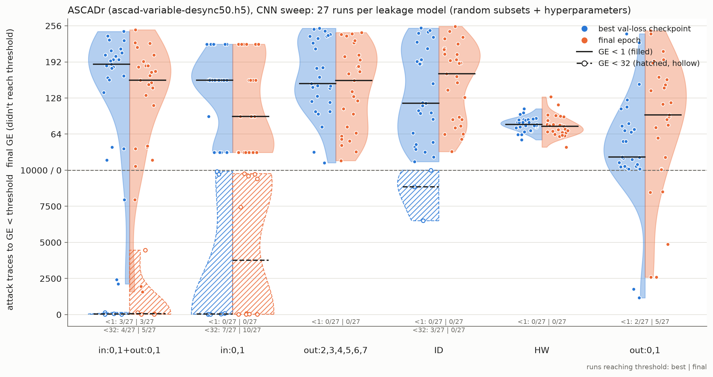
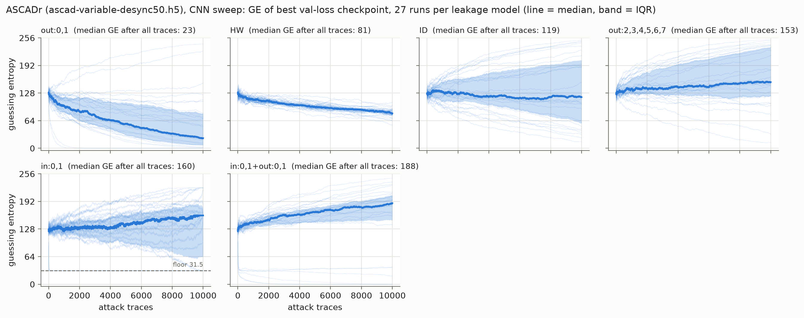

# Training on targeted leakage models: first results

*Status: 2026-09-28. MLP sweep on ASCADr complete (100 runs × 7 leakage models). CNN sweep on ASCADr desync50 in progress; the numbers below are a snapshot of the first 27 of 100 runs and will change.*

## TL;DR

- **Training on just the two S-box output LSBs (`out:0,1`) works far better than any other label we tried.** 90/100 random MLPs break ASCADr with it (median ~1.5k attack traces), versus 0/100 with ID labels at the same budget (20k profiling traces, 30 epochs). It wins the paired comparison against every other leakage model in 95–99 of 100 runs.
- **It is the specific bits, not the number of classes.** `out:2,3` is also a 4-class label, trained on identical data and hyperparameters, and only 18/100 runs break the key. Dropping the LSBs (`out:2,3,4,5,6,7`) leaves 4/100.
- **The S-box input LSBs are learned fastest.** `in:0,1` reaches its GE floor of 31.5 (64 tied key guesses) in 99/100 runs, with a median of ~40 traces. Yet the paper's 16-class `out:0,1+in:0,1` label is *worse* than `out:0,1` alone (43/100), which points to the joint label being harder to learn rather than the input bits hurting.
- **Desynchronised traces (CNN, partial):** much harder overall, but `out:0,1` is again the strongest label if we take the best-validation-loss checkpoint (it wins 19–24 of 27 paired runs). At the final epoch the ranking is scrambled, because CNNs overfit over 50 epochs.
- **Open:** the data-efficiency question needs a sweep over the number of profiling traces, and the broader question of whether different leakage models make networks learn *different internal representations* has not been tested yet (see [Next steps](#next-steps)).

## Motivation

In Karayalcin et al. (NeurIPS 2025) we found that MLPs trained on ASCADr with standard ID labels mostly exploit the two least significant bits of the S-box input `p⊕k` and of the S-box output `Sbox[p⊕k]`. This project turns that observation into a training-side intervention: instead of reading off which features a network uses, we choose which features the labels ask for.

The questions for this first round:

1. **Sufficiency:** is training only on those bits enough to break the target?
2. **Necessity:** what happens if the labels exclude them?
3. **Data efficiency:** do narrow, targeted labels need fewer profiling traces than ID or HW?

The longer-term question is whether the leakage model changes *what* the network learns internally, e.g. whether an HW-trained network builds very different share embeddings from one trained on `out:0,1`. The attack-performance results here are the first step towards that.

## Setup

**Leakage models.** Labels are built from bits of the S-box input (`in`) and/or output (`out`) of target byte 2. Terms joined by `+` are combined into one joint label.

| spec | label | classes |
|---|---|---|
| `ID` | S-box output byte | 256 |
| `HW` | Hamming weight of the S-box output | 9 |
| `out:0,1` | two LSBs of the S-box output | 4 |
| `out:2,3` | S-box output bits 2 and 3 (class-count control for `out:0,1`) | 4 |
| `out:2,3,4,5,6,7` | all output bits except the two LSBs | 64 |
| `in:0,1` | two LSBs of the S-box input | 4 |
| `out:0,1+in:0,1` | the 16 classes Y_i from the paper | 16 |

Labels that only use S-box *input* bits depend on only some key bits, so several key guesses always get the same labels (for `in:0,1`, 64 of them). We count ties as half a rank, so GE bottoms out at 31.5 rather than 0. For those models we also report when the attack reaches GE < 32.

**Training protocol (random search, paired).** Each sweep draws N runs. Each run *i* draws a random subset of 20k profiling traces and random hyperparameters, and uses **the same subset and hyperparameters for every leakage model**. Comparisons between leakage models are therefore paired, and the spread within a violin reflects sensitivity to data and hyperparameter choice.

| | MLP sweep | CNN sweep |
|---|---|---|
| dataset | ASCADr (`ascad-variable.h5`, 1400 samples) | ASCADr desync50 (`ascad-variable-desync50.h5`) |
| runs | 100 (complete) | 27 of 100 (snapshot) |
| training traces | 20k random subset of 180k | 20k random subset of 180k |
| validation | last 10k profiling traces | last 10k profiling traces |
| attack traces | 4k | 10k |
| epochs | 30 | 50 |
| architecture | 2–6 dense layers, width 32–200 | 1–4 conv blocks (Conv1d → act → BN → AvgPool, 4–32 filters doubling per block, kernel 5–51, pool 2–10), then 1–3 dense layers of width 32–200 |

Both sweeps also sample the activation (ELU/ReLU/SELU), the Adam learning rate (1e-4 to 3e-3, log-uniform) and the batch size (128–512). Traces are standardised per sample using the training subset.

**Evaluation.** Guessing entropy (GE) averaged over 100 random orderings of the attack traces, for both the final-epoch model and the checkpoint with the lowest validation loss. The violin plots put each run on one "lower is better" scale. Below the dashed line are runs that end with GE < 1, placed by the number of attack traces needed to get there. Above it are runs that don't, placed by their final GE.

## Results: MLPs on ASCADr


*Each dot is one run (final epoch). Hatched purple: runs that reach GE < 32, for leakage models with an input-bit term and ID as reference. Numbers under each violin: runs reaching the threshold.*

| leakage model | classes | runs | GE<1 final | traces to GE<1 (median) | GE<32 final | traces to GE<32 (median) | median final GE | GE<1 best ckpt | median best epoch |
|---|---|---|---|---|---|---|---|---|---|
| `out:0,1` | 4 | 100 | 90 | 1466 | 94 | 318 | 0.0 | 27 | 1 |
| `out:0,1+in:0,1` | 16 | 100 | 43 | 2458 | 84 | 54 | 1.0 | 6 | 1 |
| `HW` | 9 | 100 | 29 | 3102 | 68 | 1350 | 5.5 | 0 | 1 |
| `out:2,3` | 4 | 100 | 18 | 2989 | 74 | 1509 | 6.0 | 1 | 0 |
| `in:0,1` | 4 | 100 | 0* | – | 99 | 43 | 31.5 | 0* | 7 |
| `ID` | 256 | 100 | 0 | – | 23 | 2630 | 88.5 | 1 | 0 |
| `out:2,3,4,5,6,7` | 64 | 100 | 4 | 3548 | 25 | 2377 | 97.0 | 0 | 0 |

\* `in:0,1` cannot reach GE < 1 (floor 31.5). Median trace counts are over the runs that reach the threshold only.

Paired against `out:0,1` (same subset and hyperparameters, final epoch, compared on the combined scale):

| leakage model | runs | `out:0,1` better | other better |
|---|---|---|---|
| `out:0,1+in:0,1` | 100 | 97 | 3 |
| `HW` | 100 | 97 | 3 |
| `out:2,3` | 100 | 96 | 4 |
| `in:0,1` | 100 | 95* | 5 |
| `ID` | 100 | 99 | 1 |
| `out:2,3,4,5,6,7` | 100 | 98 | 2 |

\* Partly by construction, since `in:0,1` can't reach GE < 1.


*GE vs number of attack traces for every run (thin lines), with the median (bold) and interquartile range (band).*

### What this says

**Sufficiency: yes.** Two output bits are enough. `out:0,1` breaks the key in 90/100 runs, and its median GE curve reaches 0 within ~1.5–2k traces. This is consistent with the paper's finding that these bits carry the leakage MLPs actually use.

**It is not the class count.** The cleanest comparison in the sweep is `out:0,1` versus `out:2,3`: both are 4-class labels trained on identical data and hyperparameters, and success drops from 90/100 to 18/100. HW (9 classes) lands in between at 29/100.

**Necessity: mostly.** Excluding the two LSBs (`out:2,3,4,5,6,7`) leaves 4/100 successful runs, close to ID. ID contains the LSBs but fails completely at this budget (0/100 to GE < 1, 23/100 to GE < 32). So having the right information in the label isn't enough; with 20k traces, a 256-class target seems to be too hard for these small MLPs to learn the LSB structure from.

**Input bits are the easiest thing to learn, but combining them hurts.** `in:0,1` reaches its floor in 99/100 runs with a median of 43 traces, faster than anything else. The joint `out:0,1+in:0,1` label benefits from this for GE < 32 (84/100, median 54 traces). But it breaks the full key less often than `out:0,1` alone (43 vs 90/100), and loses 97/100 paired runs. The joint 16-class label contains everything `out:0,1` does, so this looks like an optimisation or capacity effect rather than the input bits being harmful. A factored head (separate softmaxes for the in and out bits, summed at attack time) would test this directly.

**Selecting checkpoints by validation loss fails for MLPs.** The best-validation-loss epoch is 0–1 for almost every run and leakage model, so that checkpoint is essentially untrained (27/100 successful runs for `out:0,1`, against 90 at the final epoch). Validation loss is a poor proxy for attack performance here, which is why the main figure shows the final epoch. The split version below shows both checkpoints.

<details>
<summary>Violins with both checkpoints (best val-loss left, final epoch right)</summary>


</details>

## Results: CNNs on ASCADr desync50 (partial: 27 of 100 runs)

*Snapshot taken 2026-09-28 10:01. Only runs completed for all six leakage models are included. `out:2,3` is not in this sweep.*



| leakage model | classes | runs | GE<1 final | GE<32 final | median final GE | GE<1 best ckpt | GE<32 best ckpt | median best-ckpt GE | median best epoch |
|---|---|---|---|---|---|---|---|---|---|
| `out:0,1` | 4 | 27 | 5 | 8 | 98.1 | 2 | 14 | **23.4** | 16 |
| `HW` | 9 | 27 | 0 | 0 | 78.0 | 0 | 0 | 81.0 | 21 |
| `in:0,1` | 4 | 27 | 0* | 10 | 95.5 | 0* | 7 | 159.5 | 31 |
| `out:0,1+in:0,1` | 16 | 27 | 3 | 5 | 159.7 | 3 | 4 | 187.9 | 23 |
| `out:2,3,4,5,6,7` | 64 | 27 | 0 | 1 | 159.2 | 0 | 1 | 153.3 | 2 |
| `ID` | 256 | 27 | 0 | 0 | 170.9 | 0 | 3 | 118.7 | 1 |

Paired against `out:0,1`, for each checkpoint:

| leakage model | final epoch: `out:0,1` better / other better | best val-loss ckpt: `out:0,1` better / other better |
|---|---|---|
| `HW` | 10 / 17 | 19 / 8 |
| `in:0,1` | 17 / 10 | 24 / 3 |
| `out:0,1+in:0,1` | 17 / 10 | 23 / 4 |
| `out:2,3,4,5,6,7` | 20 / 7 | 23 / 4 |
| `ID` | 16 / 11 | 21 / 6 |



### What this says so far

- **Desync50 at 20k traces is hard.** No leakage model is reliable; the best is 5/27 runs reaching GE < 1 (`out:0,1`, final epoch, median ~4.9k attack traces).
- **`out:0,1` is still the strongest label, if we pick the right checkpoint.** At the best-validation-loss checkpoint it reaches GE < 32 in 14/27 runs with a median GE of 23, and wins 19–24 of 27 paired runs against every other model.
- **Checkpoint choice matters for CNNs, the opposite of the MLP result.** CNN validation loss bottoms out mid-training (median best epoch 16–31 for most labels), and the models overfit afterwards. At the final epoch `out:0,1`'s median GE rises to 98, and HW wins 17/27 paired runs. HW is remarkably consistent (final GE between ~40 and ~130 in every run, mostly 60–100) but never breaks the key.
- **Several CNNs are confidently wrong.** For `in:0,1`, `out:0,1+in:0,1` and `out:2,3,4,5,6,7`, the median GE *rises* above 128 as attack traces accumulate (figure above), so these models rank the correct key worse than a random guess. That suggests a systematic mismatch between what they learned on the profiling traces and the attack traces, not just a lack of signal. It's worth a closer look before reading much into these rankings.
- The `in:0,1` GE values sit on steps of 64 (31.5, 95.5, 159.5, …). The 64 tied key guesses are always ranked as a block, so this is expected.

## Caveats

- **One budget.** Everything uses 20k training traces and a fixed epoch count, so conclusions like "ID fails" are about this budget, not about ID in general.
- **Small search space and short training** for the MLPs (30 epochs). The paper's ASCADr MLP used 100 epochs and more data.
- **Checkpoint selection.** Neither checkpoint is ideal: validation loss selects untrained MLPs, and the final epoch penalises overfitting CNNs. A GE-based selection criterion on a held-out set would be fairer to both.
- **Median trace counts** are computed only over runs that reach the threshold, so they aren't comparable between models with very different success rates. They also count the first time GE drops below the threshold.
- **Paired comparisons** use the combined scale (traces to GE < 1 if reached, else final GE). Leakage models with an input-bit term can't reach GE < 1, so they lose partly by construction.
- **One target byte (2) on one device.** eShard and CHES CTF are next.

## Next steps

1. **Finish the CNN sweep** (~3 h) and regenerate this section. Add `out:2,3` via `--extend` for the class-count control.
2. **Data efficiency:** sweep the number of training traces (e.g. 5k, 10k, 20k, 50k, 100k) for ID, HW and `out:0,1`, to test whether the gap closes with more data or targeted labels are genuinely more sample-efficient.
3. **Other targets:** eShard and CHES CTF from the paper. Loaders are implemented and the extracted datasets are downloading.
4. **Joint-label question:** a factored head for `out:0,1+in:0,1`, to separate "the joint label is harder to learn" from "the input bits hurt".
5. **Representations (the main longer-term question):** compare what networks trained on different leakage models learn internally. For example, do HW-trained and `out:0,1`-trained models embed the mask and masked-value shares differently? We would reuse the paper's tools (probing hidden layers for share bits, perceived information, activation patching) on paired runs from these sweeps.

## Reproducing

```bash
# MLP sweep (ASCADr)
uv run scripts/sweep.py --dataset_path ascad-variable.h5 --n_attack 4000 --n_runs 100 --epochs 30 \
    --leakage_models "out:0,1" "in:0,1" "out:2,3" "out:0,1+in:0,1" ID HW "out:2,3,4,5,6,7" --quiet
# CNN sweep (ASCADr desync50)
uv run scripts/sweep.py --dataset_path ascad-variable-desync50.h5 --model cnn --n_runs 100 --epochs 50 --quiet

# Figures and tables in this doc
uv run scripts/plot_sweep.py <sweep_dir> [--final-only] --out docs/figures/<name>
uv run scripts/plot_ge_curves.py <sweep_dir> --checkpoint {final,best} --out docs/figures/<name>
uv run scripts/summarize_sweep.py <sweep_dir> [--checkpoint best]
```

Sweeps: `results/sweep_ascadr_27_09_2026_19_17_52` (MLP) and `results/sweep_ascadr_28_09_2026_08_50_36` (CNN). Both are in the git-ignored `results/` folder.
